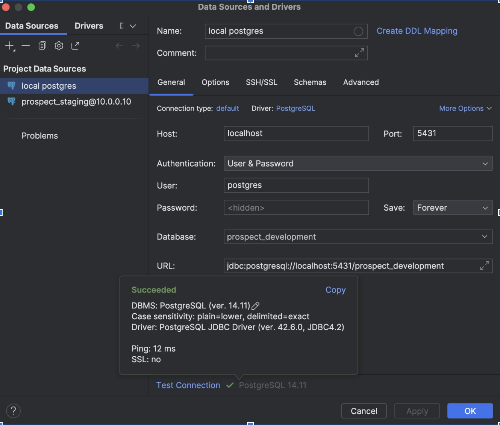
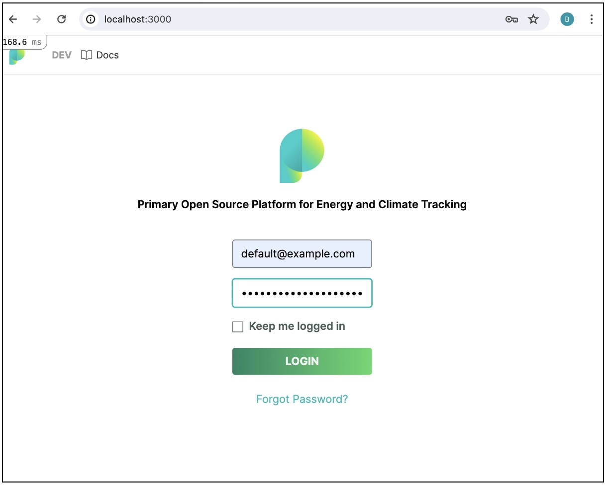
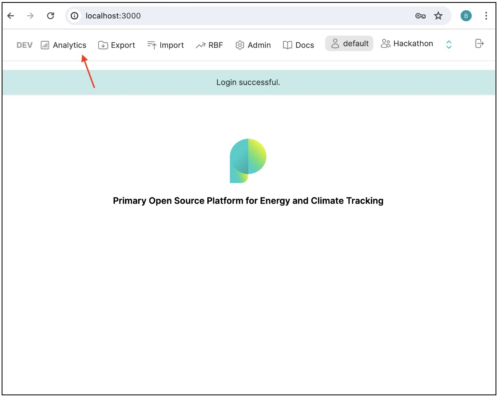
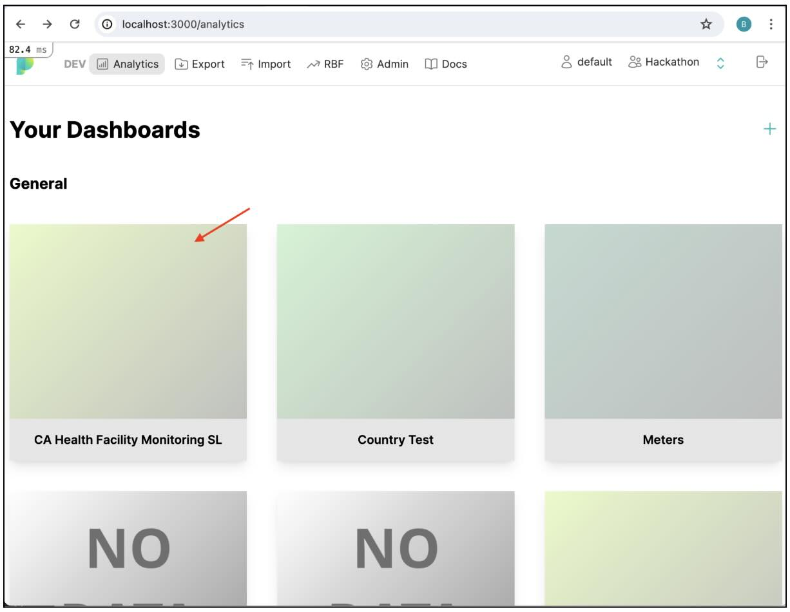
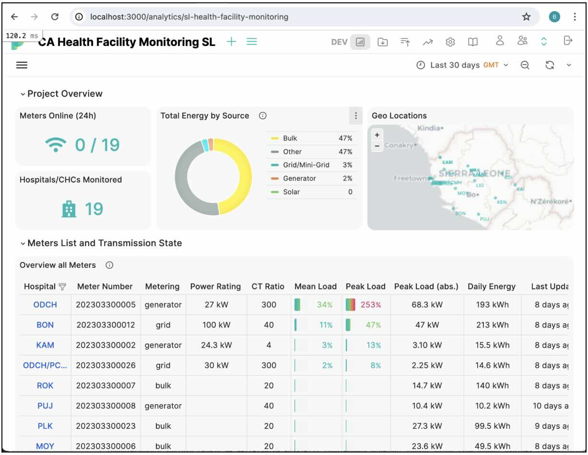
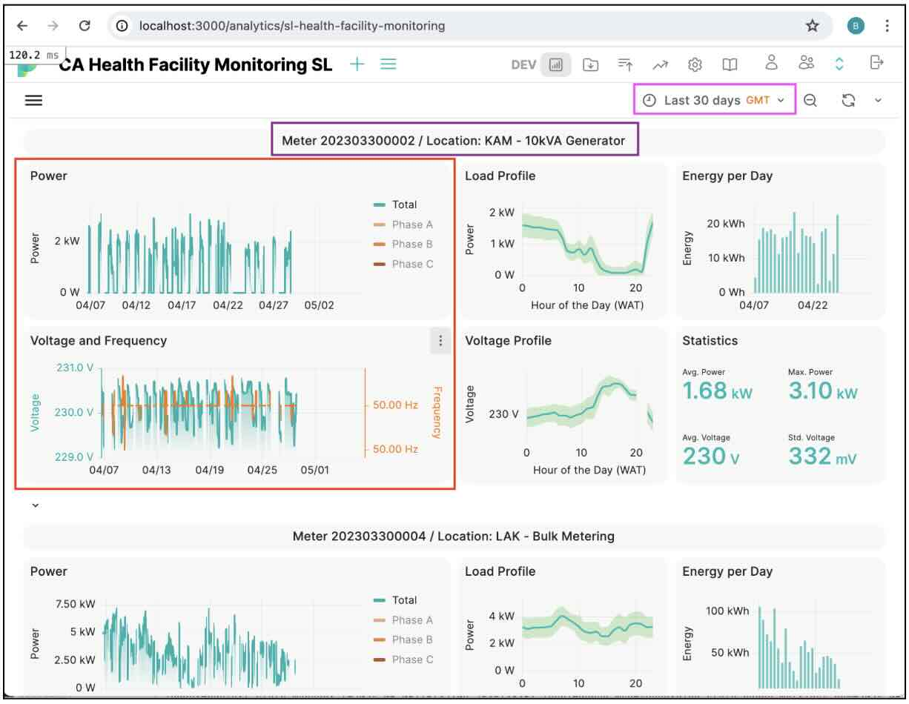

  

    9-10 May | Open Source in Energy Access Symposium Hackathon

---

## Validation algorithm of energy production data

**Stack:** Python (for being the predominant language in DataScience, but any other language will do as well)

**Helpful experiences:** DataSciences, Time-Series analysis, model training

**Abstract:** Validation of energy production data is an important topic in energy access. There is a lot of work or validation algorithms happening on different platforms, for example, Prospect, Odyssey, or D-REC.

Goal of this challenge is to develop, document and publish a reliable and reusable model to predict the validity of user provided energy production data.
A2EI will provide a training and test dataset. Participants will train their model on the test data set and publish validation results, like AUC etc..

**Expected outcome:** Presentation of the models performance statistics and documentation about the core features of the model.

**Getting Started:**
- Join the OSEAS24 Discord server: https://community.oseas.org/
- Introduce yourself in #introductions channel and join this topic’s channel
- Confirm you have access to the following Repos
  - https://github.com/EnAccess/oseas24-energy-production-data-validation
- For physical participants: Bring a computer (and required Adapters) for some hacking 🤖🧑‍💻
- Full details on setup are below.

Contact person(s): Brianna / Razvan

**Further information and resources:**

- https://odysseyenergysolutions.com/
- https://prospect.energy/
- https://drecs.org/

### Before We Start
The dataset that we’re working with is from meters measuring electricity usage in a set of health clinics in Sierra Leone.  You can use your own tool(s) of choice to visualize and work with the data, but to get you started, we’ve set up the data in the [hackathon_oseas](https://gitlab.com/prospect-energy/prospect-server/-/tree/hackathon_oseas?ref_type=heads) branch in the [prospect-server](https://gitlab.com/prospect-energy/prospect-server) gitlab repo.  This will allow you to visualize the data using a Prospect dashboard that we’ve already set up to look specifically at these meters.

Requirements and instructions to access the data are in the [README](https://gitlab.com/prospect-energy/prospect-server), but some requirements that would be helpful to prepare in advance are:
1. Download [Docker](https://docs.docker.com/get-docker/).
1. Clone the [prospect-server](https://gitlab.com/prospect-energy/prospect-server) repo locally.
1. Checkout the hackathon_oseas branch.  (Note that this is not yet finalized, so you’ll have to re-pull it before Thursday.)
1. Run `docker compose up` in a terminal within the repo folder to start the container.  This should allow you to access both the **Postgres** database with the hackathon data in it, and the **Prospect** interface where you can look at it more interactively.  The endpoints for both of these are described in Section 3 of the README.

### To Access Postgres
If you open your favorite SQL client, you can access the Postgres DB using the connection parameters in [Section 3](https://gitlab.com/prospect-energy/prospect-server#3-overview-about-all-endpoints) of the README:

There are two main tables, `data_meters` and `data_meters_ts`.  Both are described in the Prospect table documentation [here](https://app.prospect.energy/docs).

### To Access Prospect
To visualize the data with Prospect, use the Prospect endpoints described in [Section 3](https://gitlab.com/prospect-energy/prospect-server#3-overview-about-all-endpoints) of the README.  The landing page will look like:

Once you’ve logged in with the above credentials, click on Analytics:

And then the dashboard “CA Health Facility Monitoring SL”:

This dashboard has a high level view of the data, followed by panels that show the individual timeseries data for each of the 19 health clinic meters.

If you continue to scroll down the dashboard, you’ll see examples of data for a single meter.  The pink box on the top right shows the time frame, while the purple box shows the meter number and energy source.   The red box on the left shows the power, voltage, and frequency for that meter over time.  You can zoom in and out, as well as hover over the lines to see individual values.

You can use Prospect to first get a sense of the data.  Hopefully this will help to guide feature design and engineering.

### Accessing the Data in Jupyter
There’s a starter jupyter notebook in the `hackathon_oseas` branch of the repo [here](https://gitlab.com/prospect-energy/prospect-server/-/tree/hackathon_oseas/notebooks?ref_type=heads).  You should also be able to access it locally in your downloaded repo in `prospect-server/notebooks/`, as long as you’re in the `hackathon_oseas` branch.  It has two queries that should help you pull the data into jupyter in a useable format and get started.

### About the Data
In this challenge, we’re looking at electricity use over one month in 19 health clinics in Sierra Leone.  Many are connected to the grid, but it can be quite unreliable.  When the grid goes down,most of the time the backup generators are set up to immediately turn on.  We’re interested in being able to automatically detect (using the voltage, frequency, and power of the measured electricity flow) when the clinic is running on grid power, and when the grid has gone down and the clinic is running on generator power. 

The dataset includes one month of data for 19 clinics:
- Three only have measurements for generators
- Four only have measurements of grid power
- Twelve measure “bulk”, which means a mix of grid and generator.  The meter itself is blind to the energy source.  These are the ones that we’re hoping to distinguish.

Grid power and generator power have distinct patterns, which are dependent on many factors:
- Generator: model, size, and maintenance state
- Grid Power: number of facilities serviced by the grid, total power of the grid energy source, distance between the facility and the power source (ie. resistance built up in the cable)

More details soon …
